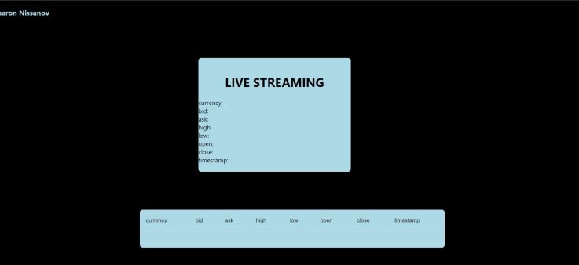

# **LIVE STREAMING**

This app displays data from: https://www.live-rates.com/rates \
and deals with the live streaming aspect and 3 API requests per hour or the hour limitation issue. \
The data displays in 2 different ways.

 I have developed this app using: \
⚡️ ReactJS, Material-UI and more. ⚡️ \



### Setup & Run
- Clone or download this repository https://github.com/sharonNissanov/LIVE-STREAMING
- Install dependencies: in cmd run ```npm install``` 
- Run the app in the development mode: in cmd run ```npm start```\
Open [http://localhost:3000](http://localhost:3000) to view it in the browser.\
The page will reload if you make edits.\
You will also see any lint errors in the console. 

Enjoy 😊
